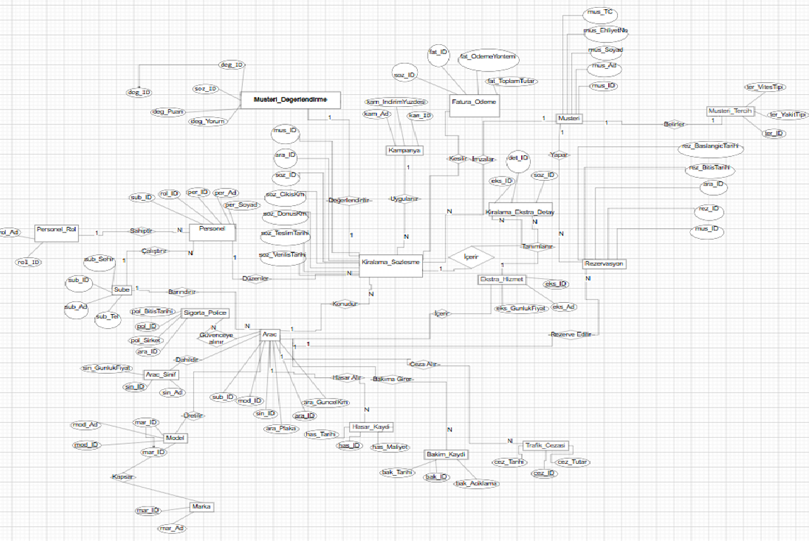
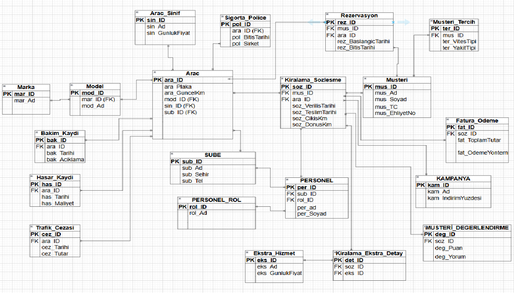

# 🚗 Rent a Car Veritabanı Yönetim Sistemi

Bu proje, modern bir araç kiralama şirketinin operasyonel süreçlerini, envanter takibini ve müşteri deneyimini yönetmek amacıyla tasarlanmış kapsamlı bir ilişkisel veritabanı (RDBMS) mimarisidir. Bursa Teknik Üniversitesi Bilgisayar Mühendisliği "Veritabanı Yönetim Sistemleri" dersi kapsamında 4 kişilik bir ekip ile geliştirilmiştir.

## 🛠️ Kullanılan Teknolojiler ve Kavramlar
- **Veritabanı:** MySQL
- **Tasarım:** ER/EER Diyagramları (Chen & Kazayağı Notasyonu), İlişkisel Şema Tasarımı
- **Kavramlar:** 1NF/2NF/3NF Normalizasyon, Primary/Foreign Key Kısıtlamaları, Çok-a-Çok (N:M) İlişki Çözümlemeleri

## 👨‍💻 Benim Sorumluluklarım ve Geliştirdiğim Modüller
Projedeki takım çalışması kapsamında, sistemin **Operasyon ve Araç Yaşam Döngüsü** modüllerinin tasarımı ve SQL implementasyonu tarafımca yapılmıştır:

* **Araç Hasar ve Bakım Yönetimi:** Filodaki araçların periyodik bakımlarını (`Bakim_Kaydi`) ve kaza/hasar geçmişlerini maliyetleriyle birlikte (`Hasar_Kaydi`) takip eden yapı.
* **Trafik Cezası Takip Sistemi:** Kiralama sürecinde yenen trafik cezalarının araca ve ilgili tarihe göre (`Trafik_Cezasi`) eşleştirilmesi.
* **Ekstra Hizmetler Modülü:** Sözleşmelere eklenebilen ek hizmetlerin `Ekstra_Hizmet` tablosunda tutulması ve çok-a-çok (N:M) ilişkilerin `Kiralama_Ekstra_Detay` ara tablosuyla çözümlenmesi.
* **Müşteri Veri Yapısı:** Temel müşteri (`Musteri`) verilerinin sisteme entegrasyonu.

## 📁 Proje Dosyaları
* `schema.sql`: Tabloların ve ilişkisel kısıtlamaların oluşturulduğu ana mimari dosyası.
* `data.sql`: Sistemin test edilebilmesi için oluşturulmuş örnek (mock) veriler.
* `queries.sql`: Karmaşık JOIN işlemleri barındıran operasyonel raporlama sorguları.
* `RentACar_Veritabani_Tasarimi.pdf`: Gereksinim analizi, iş kuralları ve tüm ER diyagramlarını içeren proje dokümantasyonu.

## 📸 Veritabanı Mimari Çizimleri

### 1. Kavramsal Tasarım (Chen Modeli)

### 2. İlişkisel Tasarım (Kazayağı / Crow's Foot Modeli)

